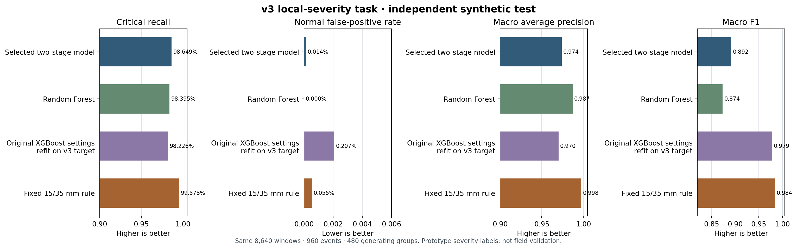
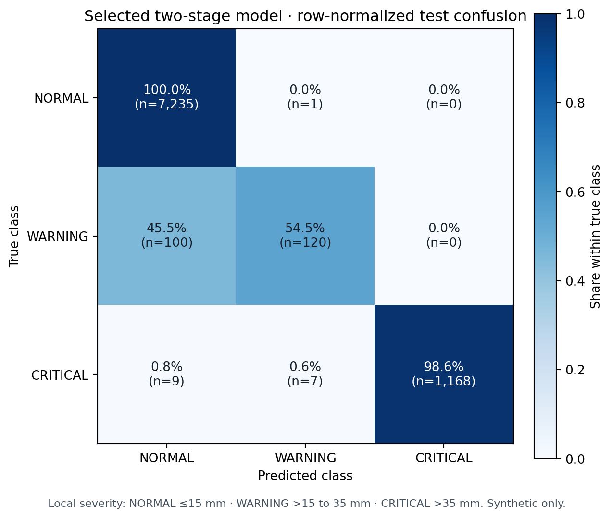
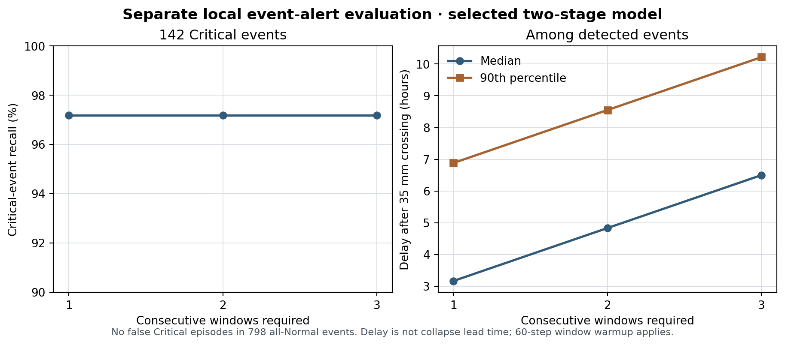
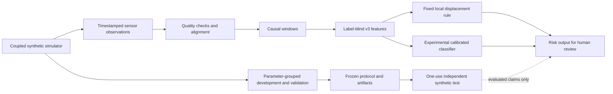

# BHURAKSHAK

BHURAKSHAK is a research prototype for detecting local ground movement from time-series sensor observations and presenting risk states for human review. The repository contains synthetic-data experiments and a seeded tabletop-data stand-in. It has **not** been validated at an operating mine and is not an autonomous evacuation or mine-safety system.

The current experiment is the versioned **v3 local-displacement severity** task. Its fresh synthetic test meets the project’s numerical gates for Critical recall and Normal false-positive rate. This is a revised, directly observable target: it does **not** establish that the earlier scenario-identity labels can be predicted. The legacy scenario-label target remains below goal. Neither task predicts the time of a mine collapse.

## Current evidence

The v3 evaluation uses 960 generated events (480 complete generating-parameter groups, two noise realizations per group) and 8,640 overlapping windows. The test uses sigmoid, smoothstep and two-stage temporal patterns withheld from development and validation, with twice the development sensor-noise scale. The one-use test was frozen before its generation and was evaluated once. All numbers below refer only to this synthetic protocol.

The label policy follows the prototype’s existing displacement rule: at the end of a causal window, NORMAL is at or below 15 mm, WARNING is above 15 mm through 35 mm, and CRITICAL is above 35 mm. These boundaries are **not geotechnical or mine-safety thresholds**. On the selected two-stage model, Critical recall is 98.65% (1,168/1,184) and Normal FPR is 0.014% (1/7,236; this counts either WARNING or CRITICAL on a Normal window). Group-bootstrap 95% intervals are 97.53–99.45% and 0.000–0.043%, respectively. The false positive was a WARNING; no Normal window was classified CRITICAL.

| Model on identical v3 test windows | Critical recall | Normal FPR | Macro average precision | Macro F1 |
|---|---:|---:|---:|---:|
| Selected two-stage model | 98.65% | 0.014% | 0.9740 | 0.8918 |
| Random Forest | 98.40% | 0.000% | 0.9870 | 0.8736 |
| Original XGBoost settings, refit for v3 | 98.23% | 0.207% | 0.9701 | 0.9787 |
| Fixed 15/35 mm displacement rule | 99.58% | 0.055% | 0.9976 | 0.9844 |

The fixed physical rule leads on this target’s Macro AP and Macro F1. The selected model was frozen before this independent test; test comparisons did not trigger another selection or tuning round. Entire generating-parameter groups stay together across development folds and test partitions, following the same non-overlapping-group principle documented for [GroupKFold](https://scikit-learn.org/stable/modules/generated/sklearn.model_selection.GroupKFold.html). Macro AP is the mean one-vs-rest average precision (stepwise AP), not trapezoidal PR-area; see [scikit-learn’s metric definition](https://scikit-learn.org/stable/modules/generated/sklearn.metrics.average_precision_score.html). Probability calibration is fit only on development partitions; the reliability-curve convention is described in the [scikit-learn calibration guide](https://scikit-learn.org/stable/modules/calibration.html). XGBoost is one investigated model family, not an assumed winner; its original method is described by [Chen and Guestrin (KDD 2016)](https://doi.org/10.1145/2939672.2939785).

The selected model classified 120/220 WARNING windows correctly (54.55%). In the separate event-level alert analysis, persistence across one, two and three windows detected 138/142, 138/142 and 138/142 critical events. Median delay after the true synthetic 35 mm crossing was 3.17, 4.83 and 6.50 hours among detected events; no false Critical episode occurred in 798 entirely Normal events. This is local threshold-crossing delay, **not collapse lead time**. The inherited 60-sample window has about 9.83 hours of warmup at ten-minute sample cadence, followed by an output every ten samples. Alert-event measures are separate from window classification scores.







### Target change and historical results

The v3 score is not a comparable improvement over the old scenario-label result. On the same v3 observations scored against retained **legacy scenario taxonomy** labels, the v3 model has 41.13% Critical recall; the previous frozen artifact has 6.74%. Neither meets the earlier 89% goal. The local-severity labels measure displacement at the current window endpoint; legacy labels mark synthetic scenario categories and can mark a window CRITICAL while local displacement is still small. The report documents that mismatch and the target change. Old v2 evaluation and optimization reports are retained as historical records and marked superseded for current claims; their graphs are no longer used as current README evidence.

Anomaly detection is also a distinct task. The historical 89.59% Isolation Forest anomaly recall is not a Critical recall score and is not part of the v3 severity experiment. It must not be compared to the v3 classification results as if the targets were interchangeable. Isolation Forest is an anomaly-detection method ([Liu, Ting and Zhou, IEEE ICDM 2008](https://doi.org/10.1109/ICDM.2008.17)); it does not by itself identify geotechnical severity.

## System and implementation status



| Component | Repository status | Notes |
|---|---|---|
| Sensor records | Prototype inputs | Synthetic streams plus a generated tabletop stand-in; no mine data |
| Physical coupling and simulator | Implemented for versioned experiments | v3 derives tilt and strain from a shared local displacement field; assumptions remain simulated |
| Causal features and windowing | Implemented | Endpoint/temporal v3 features; no labels, scenario identity or future observations in model inputs |
| Fixed displacement rule | Evaluated baseline | Strongest v3 test results on the defined local-severity labels; thresholds remain unvalidated |
| XGBoost / Random Forest | Experimental classifiers | Retained in v3 experiment artifacts; not promoted into existing deployed/default pipeline |
| Isolation Forest | Historical anomaly task | Anomaly scores are separate from severity classes |
| Regional alert state machine | Existing implementation | Neighbor confirmation is unavailable in one-node events; full regional escalation/recovery behavior is unvalidated |
| LoRa, gateway, API, dashboard | Not implemented here | Separate workstreams; no integration is implied |
| Hardware | One trapdoor scope | No additional physical components or multi-trapdoor prototype are claimed |

The synthetic v3 generator supports virtual zone conditions for analysis. A virtual zone is not a claim that additional physical sensors or trapdoors exist. Tabletop records are synthetic stand-ins and the physical rig campaign has not been run.

The related SubSense console at `/Users/harshkumarjha/Documents/printf` now includes a software-only Trapdoor Prototype view. It uses the recorded M8 × 1.25 mm screw pitch and calls `scripts/trapdoor_inference_server.py` to extract the existing tabletop window features and run the frozen tabletop RF/IF artifacts. The view models one door, marks unverified dimensions and soil response as assumptions, and labels sensor values and predictions simulated. It does not add a physical hardware integration or change any model, locked test, or evaluation artifact. See that console's `TRAPDOOR_PROTOTYPE.md` for run instructions and assumptions.

## Repository map

| Path | Purpose |
|---|---|
| `src/simulator/coupled_v3.py` | Versioned physically coupled synthetic observations |
| `src/features/causal_v3.py` | Causal v3 feature builder and fixed feature contract |
| `src/risk/severity_v3.py` | Experimental v3 severity inference |
| `configs/generalization_v3.yaml` | Frozen development, validation, search and synthetic-test protocol |
| `configs/feature_schema_v3.yaml` | Label-blind v3 model-input schema |
| `scripts/run_generalization_v3.py` | Bounded development, one-use evaluation and opt-in inference commands |
| `scripts/report_generalization_v3.py` | Rebuild the detailed report from saved aggregate results |
| `reports/generalization_v3/final_report.md` | Full audit trail, methods, metrics, limitations, test lock and reproduction steps |
| `reports/generalization_v3/independent_results.json` | Frozen aggregate synthetic test results used by the README graphs |
| `reports/generalization_v3/selected_config.yaml` | Selected configuration and thresholds |
| `reports/generalization_v3/independent_lock.json` | One-use test lock and recorded evaluation hashes |
| `data/recorded/tabletop/README.md` | Scope and regeneration details for the tabletop stand-in |

The old pipeline and v2 artifacts remain available for historical replay. The v3 candidate is opt-in; the existing `src/pipeline.py` path and deployed artifacts were not replaced.

## Reproduce reports and figures

Use the repository’s Python 3.12 environment. From the repository root:

```bash
.venv/bin/python -m pip install -r requirements.txt
.venv/bin/python scripts/report_generalization_v3.py
.venv/bin/python scripts/build_readme_model_graphs.py
```

These commands regenerate the v3 report from saved aggregate records and the three README figures from `independent_results.json`. They do not open test rows, retrain or reselect a model, or perform a new evaluation. The original bounded development and one-use evaluation commands are recorded in the [v3 report](reports/generalization_v3/final_report.md). Its reproduction procedure recreates the **same consumed test specification** in a separate directory; it is an audit/reproduction, not new independent evidence and must not be used for tuning.

To run the repository checks in the established environment:

```bash
.venv/bin/python -m pytest tests/ -o addopts='' -q
```

The v3 work reported 675 passing tests. Re-running tests verifies current code behavior only; it does not reproduce model selection or provide additional field validation.

## Limitations and next validation

The v3 evidence is synthetic and shares assumptions with its generator. Noise scales and fault behavior are configured rather than estimated from mine instrumentation. The thresholds are a borrowed prototype policy, and Critical sensitivity does not establish warning usefulness: WARNING recall is 54.55%. Long windows cause substantial warmup and detection delay. The one-node event design cannot validate neighbor confirmation, spatial consensus, or the existing alert engine’s complete regional escalation and recovery behavior. Workstation timing is not an edge-device benchmark. No physical tabletop campaign or real mine trial has been completed.

The legacy scenario-label target remains unresolved. A future claim requires fixing or replacing that target with reviewed physical labels, collecting independent measurements on the existing one-trapdoor scope, validating threshold meaning with geotechnical expertise, improving delay and WARNING sensitivity under development-only work, and then using a separately frozen untouched test. The test already reported here must remain closed to tuning.

## Reports

- [Current v3 experiment report](reports/generalization_v3/final_report.md)
- [Current v3 progress log](reports/generalization_v3/PROGRESS_LOG.md)
- [V3 experiment task ledger](reports/generalization_v3/TASKS.md)
- [Legacy one-time v2 evaluation — historical, superseded](reports/final_eval.md)
- [Legacy tuning report — historical, superseded](reports/tuning_report.md)
- [Leakage audit](reports/leakage_audit.md)
- [Workstation inference profile](reports/inference_profile.md)
- [Synthetic data manifest (legacy corpus)](data/synthetic/dataset_manifest.json)
- [Tabletop records README](data/recorded/tabletop/README.md)

> **Safety boundary:** This prototype detects and analyzes controlled synthetic local movement under a stated label policy. It has not demonstrated mine safety, operational performance, collapse prediction, or the exact time of a mine failure. Any real-world interpretation requires independent measurements and qualified geotechnical review.
