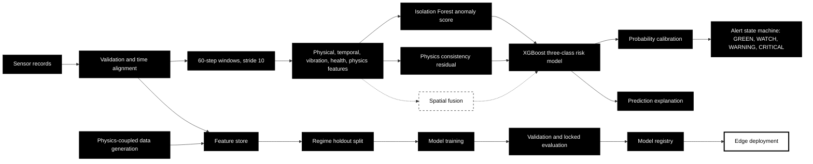
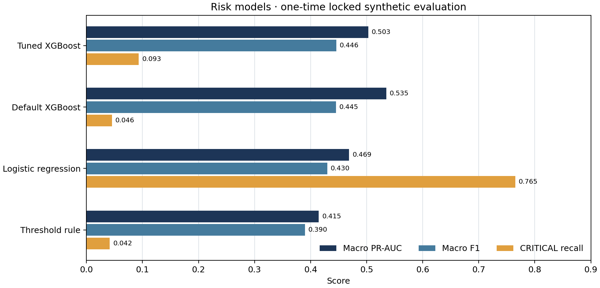
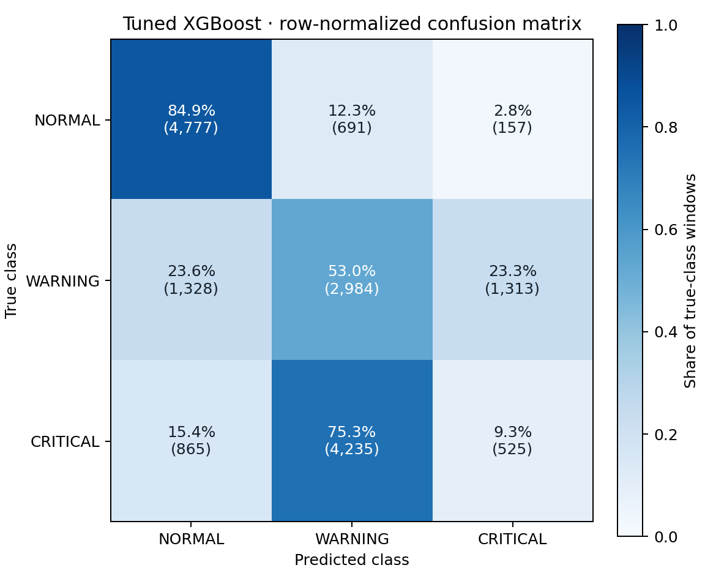
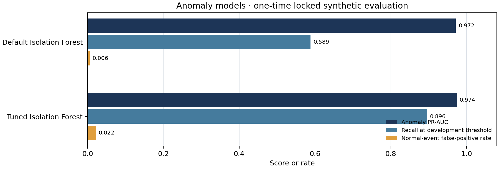

# BhuRakshak

BhuRakshak is a prototype for early warning of underground coal mine ground movement, using a sensor mesh and layered risk scoring.

Built for SIH 2026, Problem Statement 26025.

## Problem

This project models ground movement from sensor records and tests whether those records can support risk alerts. Evaluation uses synthetic and tabletop data; performance at a mine has not been established.

## What this repository contains

| Component | Status | Evidence |
|---|---|---|
| Sensors | PROTOTYPED | [Recorded tabletop data](data/recorded/tabletop/README.md) |
| LoRa mesh | OTHER WORKSTREAM | No LoRa implementation in this repository |
| Gateway | OTHER WORKSTREAM | Not implemented in this repository |
| ML pipeline | BUILT | [Pipeline](src/pipeline.py) |
| Alert engine | BUILT | [Alert engine](src/risk/alert_engine.py) |
| API | OTHER WORKSTREAM | Not implemented in this repository |
| Dashboard | OTHER WORKSTREAM | Not implemented in this repository |

## ML architecture

Solid paths are implemented. Dashed paths are gated or planned.



| Stage | Module | Input → output | Purpose |
|---|---|---|---|
| Validation | `src/preprocessing/validation.py` | Sensor rows → quality flags | Detect missing, repeated, out-of-order, or corrupt records |
| Alignment | `src/preprocessing/align_modalities.py` | Sensor streams → aligned streams | Put measurements on a shared timeline |
| Windowing | `src/features/windowing.py` | Aligned streams → windows | Build overlapping 60-step windows with stride 10 ([manifest](data/synthetic/dataset_manifest.json)) |
| Feature store | `src/features/build_feature_store.py` | Windows → feature rows | Compute physical and temporal features |
| Anomaly score | `src/anomaly/isolation_forest.py` | Training windows → anomaly score | Flag departures from healthy training data |
| Physics check | `src/physics/consistency.py` | Movement and coordinates → residual | Compare measurements with the configured deformation model |
| Spatial fusion | `src/features/group_c_spatial.py` | Co-temporal nodes → neighbor evidence | Gated because each synthetic event has one node |
| Risk model | `src/risk/xgboost_model.py` | Features and scores → NORMAL, WARNING, CRITICAL | Estimate event risk |
| Calibration | `scripts/freeze_models.py` | Validation predictions → calibrated probabilities | Fit calibration without using the locked test set |
| Alert state | `src/risk/alert_engine.py` | Probabilities and evidence → alert level | Apply configured thresholds and persistence |
| Explanation | `src/risk/explainability.py` | Prediction and signals → explanation | Return contributing signals with each risk output |
| Offline training | `src/simulator/`, `src/features/`, `src/evaluation/` | Synthetic records → model artifacts | Generate data, build features, split by regime, train and evaluate models |

## Data

The seeded simulator couples tilt, displacement, strain, and vibration to a shared deformation field, then adds sensor noise and faults. Fault types include bias, stuck readings, dropout, spikes, and drift. Scenario families cover stable ground, communication faults, sensor faults, vibration-only events, and several rates and patterns of subsidence. The [dataset manifest](data/synthetic/dataset_manifest.json) records 10,000 generated sequences, 1,440,000 sensor rows, 90,000 windows, and 61 stored features. Labels cover anomaly, risk, progression, and fault type.

The default split holds out scenario families and parameters; it assigns 6,516 training, 1,609 validation, and 1,875 test events. The locked synthetic evaluation is tracked separately in [test_lock.json](reports/test_lock.json) and was run once. The [tabletop records](data/recorded/tabletop/README.md) contain a physical rig's sensor log and trial metadata. They are not mine measurements.

## Results

The one-time locked evaluation covers unseen synthetic regimes. It does not measure performance at a real mine. Tuned XGBoost reached 0.093 critical recall, 0.503 macro PR-AUC, and 0.446 macro F1. Logistic regression reached 0.765 critical recall, with a 0.626 false-alarm rate on normal windows. The tuned model does not lead on every metric.



The tuned XGBoost confusion matrix shows where its misses occur. Most true CRITICAL windows were classified as WARNING.



The tuned Isolation Forest raises anomaly recall to 0.896 at the development healthy threshold; its normal-event false-positive rate is 0.022, compared with 0.006 for the default model.



Exact locked-test scores and alert results are in the [evaluation report](reports/final_eval.md). The [inference profile](reports/inference_profile.md) measures workstation latency and sampled memory; it does not establish an edge-device budget. Development calibration results are in the [tuning report](reports/tuning_report.md).

## Quickstart

Use Python 3.12. From the repository root:

```bash
python3.12 -m venv .venv
.venv/bin/pip install -r requirements.txt
.venv/bin/python scripts/generate_synthetic_nodes.py --sequences-per-scenario 625 --seed 42
.venv/bin/python scripts/make_split_assignment.py
.venv/bin/python scripts/build_and_run_notebook_03.py
.venv/bin/python -m pytest tests/ -q
.venv/bin/python scripts/run_pipeline.py
```

The three data commands create the ignored synthetic corpus and feature store required by the tests and pipeline. The pipeline prints a development validation summary and writes `experiments/pipeline_run.json`; it does not read the locked test corpus.

Rebuild the result graphs embedded above from the saved evaluation record:

```bash
.venv/bin/python scripts/build_readme_model_graphs.py
```

## Repository layout

```text
configs/       Model, sensor, and alert settings
data/          Synthetic, processed, locked, and tabletop records
experiments/   Pipeline outputs
models/        Model artifacts and registry
notebooks/     Exploratory and reproducible analysis
reports/       Evaluation and validation reports
scripts/       Dataset, training, and evaluation commands
src/           Simulator, preprocessing, features, risk, and evaluation code
tests/         Unit and pipeline checks
```

## Reports and notebooks

- [Locked evaluation](reports/final_eval.md)
- [Tuning report](reports/tuning_report.md)
- [Leakage audit](reports/leakage_audit.md)
- [Workstation inference profile](reports/inference_profile.md)
- [Dataset manifest](data/synthetic/dataset_manifest.json)
- [Tabletop records](data/recorded/tabletop/README.md)
- [Synthetic data notebook](notebooks/01_synthetic_data_generation.ipynb)

## Limitations and roadmap

Validation uses synthetic data and recorded tabletop trials, not a working mine. Each synthetic event contains one node, so spatial confirmation is unavailable. Forecasting is limited by the available windows. InSAR and DGPS processing use simulated inputs. Field sensors, network hardware, gateway, API, and dashboard integrations are outside this repository. Real-mine validation and broader spatial data are needed before field use.

## Honesty Statement

> This prototype can detect and analyze controlled ground movement on a lab-scale model. It cannot yet predict the exact time a real mine would fail. Before any real-mine use, risk thresholds and prediction accuracy must be tested and calibrated with real mine data and geotechnical expertise.

This statement is binding for how every claim in this repository should be read.

## Non-Goals

- Predicting the exact time or magnitude of a catastrophic collapse.
- Replacing certified geotechnical survey or regulatory subsidence assessment.
- Operating as a fully autonomous evacuation-triggering system — CRITICAL alerts recommend action; evacuation remains human-authorized.
- Building a production-scale multi-mine SaaS platform in the prototype phase (architecture should allow for it later, but MVP targets one panel).
- Raw SAR/InSAR processing on the Raspberry Pi (done externally/offline on a workstation).
- Mandatory GNN-based spatial modeling for MVP (reserved as future work, gated behind an ablation showing engineered spatial features are insufficient).

## Versioned v3 local-severity experiment

The [v3 report](reports/generalization_v3/final_report.md) records a new physically coupled generator and causal feature schema. The candidate passed a fresh synthetic test at **98.65% Critical recall and 0.014% Normal FPR**, using the existing prototype's **15/35 mm local-displacement severity policy**. This is explicitly a different target from the old scenario-wide labels; the original scenario-label target remains unmet (41.13% recall for the v3 candidate on the retained labels). The fixed physical threshold baseline also passed and had better macro F1.

This is synthetic local-severity detection, not field validation or collapse prediction. The one-trapdoor hardware scope and deployed artifacts are unchanged. Code/data/label semantics, group-bootstrap intervals, delayed event detection, failed draft, model comparisons, and exact reproduction/inference commands are in the report. V3 inference is opt-in through `scripts/run_generalization_v3.py`; the existing v2 replay path is preserved.
